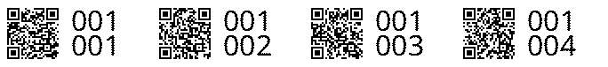
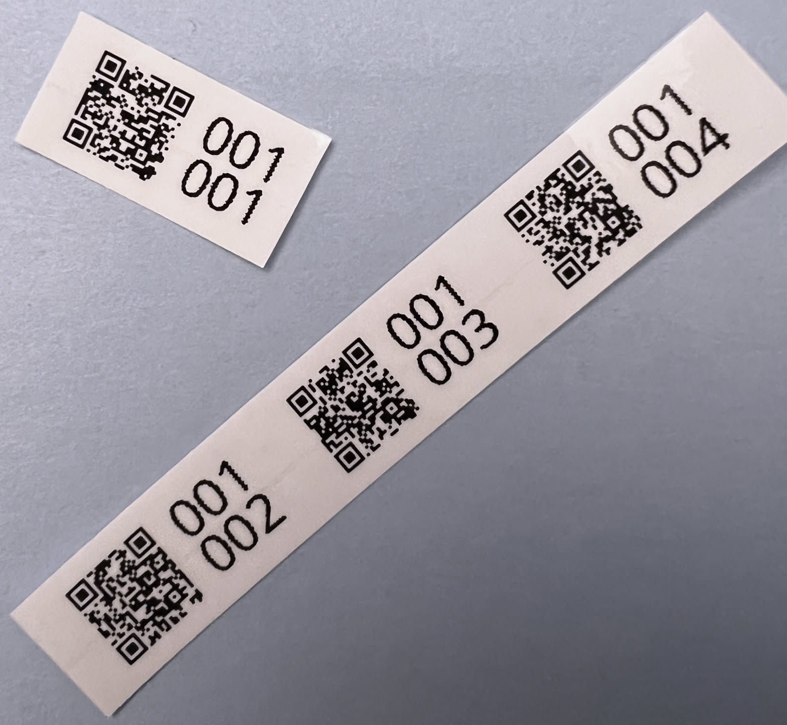

# HomeBox Label Printing

Generates and prints asset tags for use with HomeBox and Brother label printers. Asset tags include the asset ID and a scannable QR code. 

This lets you pre-print many asset tags ahead of time and apply them to objects as they're being added to HomeBox. I spool the labels into a small roll and cut them off as needed. 




*Disclaimers*:
- only tested with the Brother PT-D450 using 12mm tape on NixOS via a USB connection.
- heavily vibe coded with Gemini, this is a quick and dirty project.


## Installation

Dependencies (`qrcode`, `Pillow`, `ptouch-print`) are managed via `nix-shell`. To set up your environment:

```bash
nix-shell
```
This will drop you into a shell with all necessary dependencies available.

## Usage

The `qr.py` script accepts several command-line arguments to control its behavior.

### Basic Generation

To generate a strip of labels for a range of asset IDs:

```bash
python qr.py --start 000-001 --end 000-005
```
This will create an image file named `asset_labels.png` by default.

### Command-Line Arguments

*   `--start <ASSET_ID>` (required): The starting asset ID in "XXX-YYY" format (e.g., `001-001`).
*   `--end <ASSET_ID>` (required): The ending asset ID in "XXX-YYY" format (e.g., `001-005`).
*   `--domain <DOMAIN>`: The domain for the QR code URL (e.g., `box.example.com`).
    *   Can also be configured via the `HOMEBOX_DOMAIN` environment variable. The `--domain` flag takes precedence.
*   `--print`: If specified, the generated label strip will automatically be sent to the printer using `ptouch-print`. Requires `ptouch-print` to be correctly configured and the printer to be connected.
*   `--output <FILENAME>`: Specify the output filename (e.g., `my_custom_labels.png`). If not specified, the default filename `asset_labels.png` will be used.

### Examples

**Generate labels and save to a custom file:**

```bash
python qr.py --start 000-010 --end 000-015 --output project_x_labels.png
```

**Generate labels and print directly:**

```bash
python qr.py --start 000-001 --end 000-023 --print
```

**Generate labels with a custom domain:**

```bash
python qr.py --start 004-001 --end 004-002 --domain myhomebox.local
```

**Using the `HOMEBOX_DOMAIN` environment variable:**

```bash
export HOMEBOX_DOMAIN="myhomebox.local"
python qr.py --start 005-001 --end 005-002
```

## Extra Notes

### NixOS USB Permissions

If you are on NixOS, you might need to add USB permissions for your Brother printer.
Use `dmesg` to validate that the vendor (`idVendor`) and product IDs (`idProduct`) are correct for your device.

```nix
services.udev.extraRules = ''
  SUBSYSTEM=="usb", ATTR{idVendor}=="04f9", ATTR{idProduct}=="2073", MODE="0666", GROUP="lp"
'';
```
The `idVendor` "04f9" and `idProduct` "2073" are typical for Brother PT-D450.
